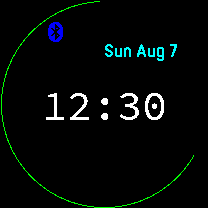

# fr55Face
A simple watch face for Garmin Forerunner 55

The date,
hour and minutes (in 12-hour format),
a bluetooth icon when connected,
and a battery indicator ring.
#

#
Written with SDK version 4.1.5, and built (tested) for minimum SDK 3.2.0
